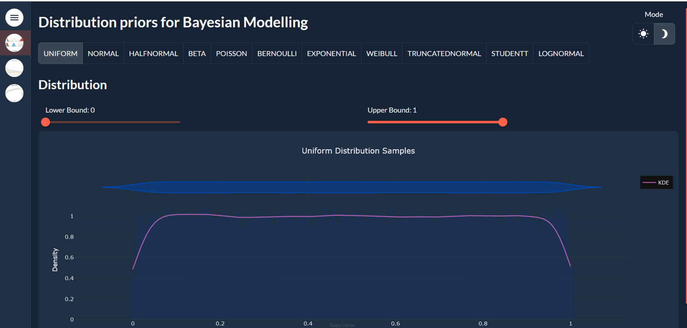

## Marketing Mixing Model
Imagine that you work in a marketing department and want to investigate if your advertising investments paid off or not. If so, To what extent did  all advertising contribute to the sales or conversion/user acquisition? If our model can do this, we can also use it to compute ROIs and optimize spending, which is what companies ultimately want. With this goal in mind we present a concrete example of estimating the media effects via bayesian methods, following the strategy outlined in Google’s paper. [“Bayesian methods for media mix modeling with carryover and shape effects.” (2017)](https://research.google/pubs/pub46001/)

The Bayesian technique works particularly effectively with homogenous data, which means that the impacts of your advertising expenditures are comparable across your dataset. But what if we have a diverse dataset, such as expenditure across multiple countries? There are two obvious approaches to deal with it

Ignore the fact that there are several countries in the dataset and build a 
1. single big model.
2. Build one model per country.
3. Hierarchical Model 


## Variable Transformations for Media Mix Modelling

Webapp for helping priors distributions and demonstrating variable transformations (adstock and saturation) used in Media Mix Modelling
You can open app and see what explicit priors distribution and transformations can used for modelling by varying the paramaters and its shapes.



### Prereuisites
- Python3
- clone the repo


#### Commands to install 

```
pip install requirements.txt
python main.py
```

